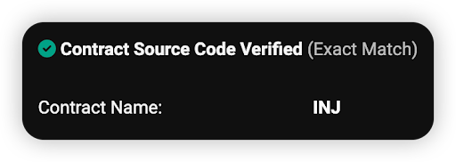

## Introduction
Gas Mint Scams are not new on BSC. They have been documented relatively well on Web3 newsletters and by security companies in the space.
However, we noticed that scammers are recently changing some of their techniques, hence we decided to write this blog to offer more understanding of this scam.

## Recap
This is how the scam typically work:
1. A user notices an unknown airdropped token in his wallet, usually it mimics a valuable or well known token like USDT. In other cases, it might be the latest trends like Friend.Tech.
 
2. He then proceeds to “approve” it to a DEX router such as PancakeSwap, in hopes of selling it for a profit. Subsequently, he tries to swap it on the DEX but to no avail as the transaction reverts. But didn’t he already grant approval for the DEX?
 
3. At the same time, he notices that the token is still in his wallet and he lost some BNB as well. He was scammed!

**What actually happens** is that when the user interacts with the unknown token at step 2, the token inadvertently took his gas provided in the transaction to create gas tokens. Furthermore, the gas requested in the transaction will be at unusually high costs.

1 popular instance of gas tokens on BSC is the CHI Gas token, you can refer to this [link](https://blog.1inch.io/everything-you-wanted-to-know-about-chi-gastoken/) here for more information. Essentially, they are tokens that utilize the “gas refund” feature of the EVM that allows refunds when clearing storage. This allows users to mint gas tokens when fees are low, and burn them when fees are high, effectively "locking in" the lower fee.

In other words, the victim is minting CHI Gas tokens for the scammer so they can reduce their gas costs in future transactions.

**New variations of the scam:**
1. Other common ERC20 methods invoke the same scam. For e.g, trying to move the token using the “transfer” method will lead to users invoking the minting too.
 
2. Recently, we noticed that scammers now prefer to mint XEN tokens with the victim’s gas during the transaction.

For context, XEN is a social mining project based on a Proof of Participation mechanism. XEN tokens are minted using gas as well, and the tokens can only be claimed after a waiting period. XEN tokens do have value in the secondary market. Therefore, scammers can profit by gaining these XEN tokens from you and dumping them later.
 
3. Creating fake approvals. This is not exactly new but we would like to elaborate more on how it works. 
  
Revoke product platforms like [Bscscan](https://bscscan.com/tokenapprovalchecker) or [Debank](https://debank.com/) naively log all approval events related to your wallet. Then, they are displayed nicely in a dashboard for you to see.
However, the issue is that approval events can actually be faked by the scammers.
 
Let’s look at this example:
BscScan approver check:

On first glance,
it looks like this user has multiple unlimited allowance for their tokens. However these are all not real (the token and the approval).
This is my 1 instance of a Fake approval transaction
https://bscscan.com/tx/0x3c3f16b418e6dcc39f03628f288d9aaba1a3cbb2e1843d92d651b61625329a95#eventlog 

There are 1000 falsified approvals in just 1 transaction!

Looking into each of them, we can see that the token address is fake!

  
 
The fake token here mimics the INJ token and might appear to be be verified contract. However, it is actually a proxy contract, which points to an unverified logic contract here: 0x54d1527668bd83f719b5414141a912cbbda55382 (**This is where the scam logic is**)
The real INJ token address is 0x**a2b**726b1145a4773f68593cf171187d8ebe4d**495**. *Notice that the token address prefix and suffix are scarily similar to trick victims.

## Current landscape of scammers’ methodologies
Understanding when and how scammers create these scam opportunities will help us be more familiar and to better avoid them.
1. Cast a wide-net

    - By airdropping fake notable tokens like USDT or USDC to victims’ wallets
 
    - Then by creating fake approval transactions for fake notable tokens like USDT or USDC, which are displayed on revoke pages like [Bscscan](https://bscscan.com/tokenapprovalchecker).
 
2. Wait for specific events
    
    - A hack event happened, airdrop / create fake approval transactions for the related hack project token / spender, so that users will ‘revoke’ them. For example, a particular project named "A" has been hacked, the scammers will mint and create a fake approval with a fake token "A" to the real "A" holders. As users are taught to revoke access for their "A" tokens, they see that there is an approval for the fake token "A" as well, promptly getting scammed of their gas.

For all cases, scammers ensure that the gas provided is enough to mint the scammers’ desired amount of CHI gas tokens or XEN tokens. I.e if the gas is too low, the scam transaction will likely revert.

## Security Recommendations from HashDit

1. Do not touch any new unknown tokens. These tokens might appear to have value based on a liquidity pool the scammer created. Do not fall for it!
 
2. Always check the token address for legitimacy. You can cross reference this with platforms like [CoinMarketCap](https://coinmarketcap.com/).
 
3. The underlying scam technique requires an unusual high gas cost, hence this is a **major red flag** if seen on the transaction page.
 
4. Use [revoke.cash](https://revoke.cash/). The platform uses heuristics to filter out fake approvals. Keep in mind this is not 100% so you should still pay attention.
  
HashDit is actively tracing and blacklisting these scam addresses on our HashDit API. Do download the HashDit chrome [extension](https://tinyurl.com/mnsv3f7y) to safeguard yourself in the future!

We hope that this blog helps educate you on this Gas Mint scam so that you can stay safe in this space.
Final security takeaway: ***do not sign any transactions if you do not know what it does***.

Feel free to consult us at our email support@hashdit.io if you have any other queries.
 

