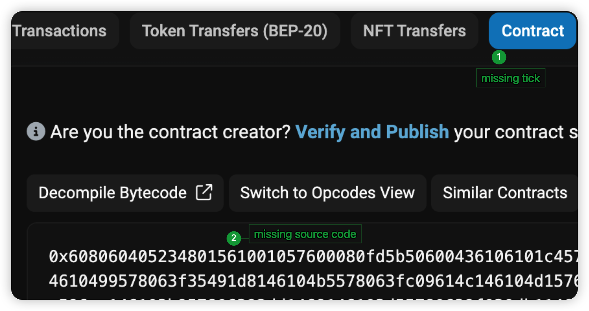
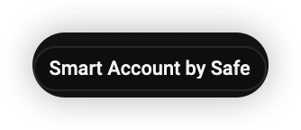
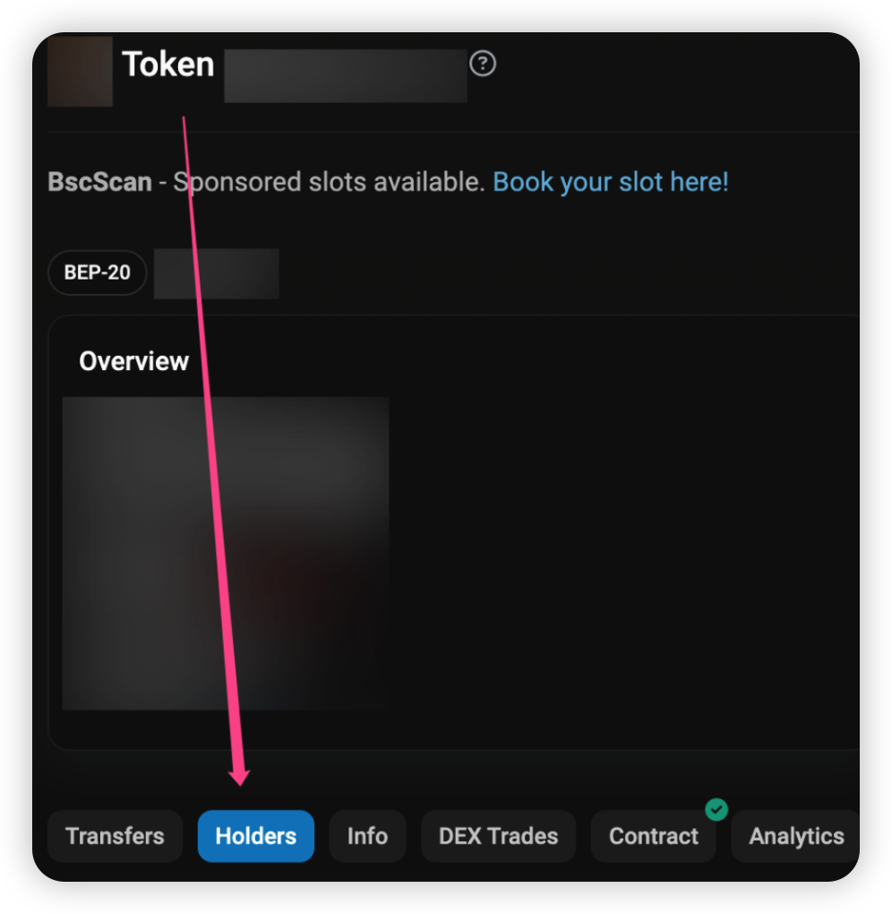

## Meme Education Guide

### Introduction

Since its inception, meme tokens have earned themselves a polarizing reputation in the crypto space. From the fun frenzy around Doge coins, Cat coins, Pepe coins, to the latest hype surrounding Solana memes, they've become a phenomenon that’s difficult to ignore. Their promise of potentially delivering exponential returns attracts many users. But with great rewards come great risks.

In the decentralized web3 world, fraud such as honeypot scams and rugpull schemes are unfortunately common. These deceptive strategies often use innocuous meme tokens as bait, exploiting the pseudonymous nature of addresses to deceive unsuspecting investors. 

At HashDit, we're committed to maximizing user security by providing countermeasures to these issues. Our aim is to enable more users to understand the potential risks associated with tokens they encounter, especially as trading becomes increasingly accessible with the surge of channels, with Telegram bots being one good example. 

HashDit provides token scanning and threat intelligence services to platforms such as PancakeSwap and Trust Wallet, where users can make informed decisions after being notified of the risks. Platforms like DAppBay have also integrated our API, offering a scanner that users can employ to evaluate the risk associated with a token before investing in it.

However, while automation can help to identify most risks, it's not completely foolproof. Even the most sophisticated models can have false positives. So, how can you personally ensure a meme token's safety before investing? Here's a basic checklist:

### As a meme user investor:

1. **Research the Token:** Start your exploration by looking into the meme token online. Rely on trustworthy sources such as the project's website, or reputable third-party sites like [CoinMarketCap](https://coinmarketcap.com/view/memes/). This helps you glean a well-rounded view of the asset.

2. **Verify the Contract Address:** Token replication is a common forgery tactic. To avoid falling into honeypot traps or scams, ensure that you're investing in the legitimate token by verifying the contract address with authentic sources like the project’s website. 

3. **Investigate the Team and Developers:** Confidence in a token is often synonymous with the team behind it. Check their track record and transparency levels. Always remember, a credible team builds a credible token.

4. **Audit Reports:** It is important to find out if professional security auditors have vetted the meme token’s code. Audit reports from reliable firms can significantly mitigate the risk of scams hidden in the code.

5. **Social Media and Community Interactions:** Stay engaged with the project’s online communities on platforms like Telegram, Twitter, Discord, and so forth. Active and responsive social media channels underscore the project's genuine nature.

6. **Smart Contract Checks:** Basic review of the smart contract code is strongly advised, [BscScan](https://bscscan.com/) is a good way to check this. Firstly, check if the contract code is verified or open-source. (Paste the address on BscScan. Click on Contract and then Code.)

If the contract code has been verified, there should be an accompanying green tick seen.

If the contract has not been verified, the code would not be seen and there would be no green tick.

 
If the code is verified, users should then proceed to look for any privileged functions that the team has access to, within the "Search Source Code" box.

The presence of these privileged functions might pose a potential security risk to investors, causing loss of funds.

Common privileged functions can include, but not limited to: mint(), pause(), blacklist(), whitelist(), setFee(), etc. An easy way to search through the code is to use keywords (ctrl-F) like “onlyOwner” and “authorized”. 

However, it is possible that the privileged role has been renounced i.e the dead address. As such, it is critical to check if the privileged role is an Externally Owned Account (EOA). To verify the ownership, click on “Read Contract” and search for “owner”.

If the address is an EOA, you would see an “Address” label beside the actual address, as seen below.

However, do take note that the address could be a “Dead address”. A “Dead address” in crypto terms simply means that nobody has the keys to this account and hence the tokens there would be taken out of circulation. 2 common examples are 
[0x0000000000000000000000000000000000000000](https://bscscan.com/address/0x0000000000000000000000000000000000000000) and [0x000000000000000000000000000000000000dead](https://bscscan.com/address/0x000000000000000000000000000000000000dead)

In other circumstances, you could see another label called “Contract”. This simply means that another smart contract has privileges over this token. 

If it was a Multi-Signature wallet, you would see a “Smart Account by Safe”. This is relatively more secure as multiple owners can verify transactions.

If this label is not there, it could be a Timelock related smart contract managed by the team. In this case, users should check with the team to get more clarity. 

7. **Automated Security Scanners:** Other external tools such as GoPlus and Honeypot.is can be utilized to cross-check that the token is indeed secure. This increases confidence in the security assessing process.

8. **Liquidity Locks:** A locked liquidity usually denotes a safer investment. You can check this on the project's website, as well as verify through independent tools like BscScan. Detecting a lack of liquidity lock could save you from falling for a rug pull. 

Most meme projects would inform their investors on their site that a certain percentage is burned or locked. However, to ensure that this information is accurate, you are encouraged to verify this with BscScan. You can follow the following steps:

* After pasting the address, click on the token link under “More Info” -> “TOKEN TRACKER”. 
* Then, click “Holders” to check who are the top holders for the meme token.

Some of the positive signs to look out for amongst the top holders include the presence of Dead addresses, having its supply stored in Multi-Signature wallets or being listed on Centralized Exchanges (CEXs) like Binance. This means that some of the liquidity is locked temporarily with trustable entities or permanently with these addresses.

Another common strategy for meme tokens is to use a Liquidity Locker. There are 2 types here: either a 1) 3rd party Locking-as-a-Service platform or a 2) Personal locking contract deployed by the team.

Popular 3rd party platforms include PinkSale and Unicrypt locking services. As such, their respective labels will be visible in the Holders list as seen below.  

A personal Locking contract by the team could be a smart contract with the name “Vesting / Locking wallet”, as seen in the image below.

Similarly, you can apply the same process to the liquidity token. Usually, this would be a PancakeSwap LP token. To get the liquidity token from the meme token, you can use another tool like dextools.io, paste the address to obtain the pair contract address.

### As a meme project owner:

To launch and maintain a successful and trustworthy meme token, consider the following:

1. **Transparency:** Keep your team identities accessible, and refrain from restricting users' comments on community platforms like Twitter or Telegram. Posting regular updates about the project's progress are also key to building trust and transparency.

2. **Credibility:** Forge partnerships with reputable projects, and aim to list your token on recognized centralized or decentralized exchanges that have established themselves as being trustworthy. These actions can help to add credibility to the meme token.

3. **Supply Locking:** Locking your token's supply adds an extra layer of security and stability to your project. This includes not just the token’s supply, but also the liquidity on decentralized exchanges. As a guideline, the locking period should be at least 1 year. Numerous platforms offer Locking-as-a-Service, or you could opt to deploy your own locking or vesting contracts using libraries like [OpenZeppelin](https://github.com/OpenZeppelin/openzeppelin-contracts/blob/master/contracts/finance/VestingWallet.sol).

### Conclusion

In conclusion, exercising awareness and caution by both users and project owners are essential for fostering growth in the dynamic world of meme tokens. By following the safety guidelines here, users can avoid potential pitfalls, and projects can increase their chance of success. 

It is important to take note that meme tokens generally contain high risks and can have significant price fluctuations so users should be wary in terms of their risk management.

