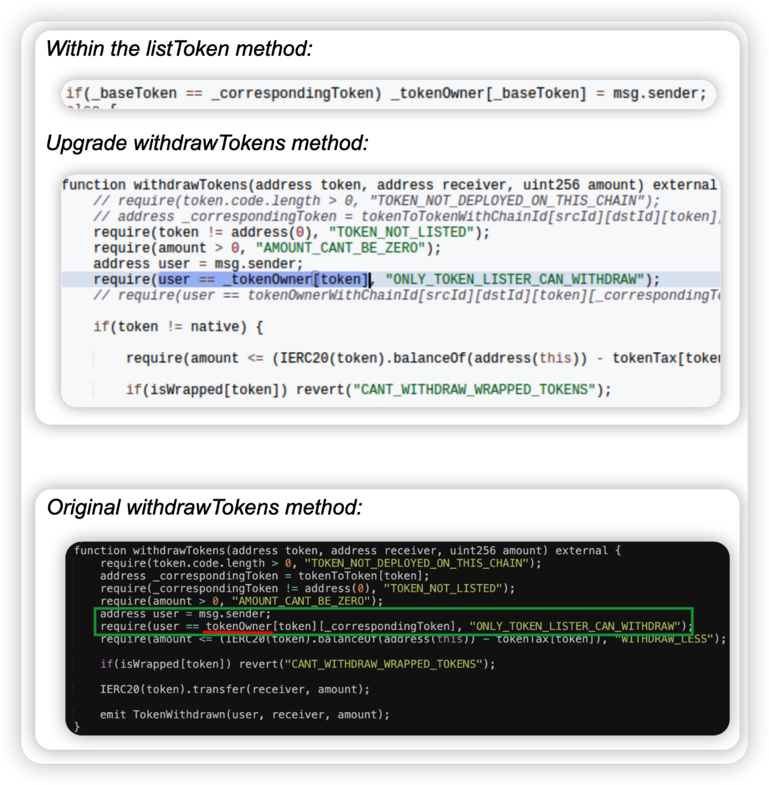
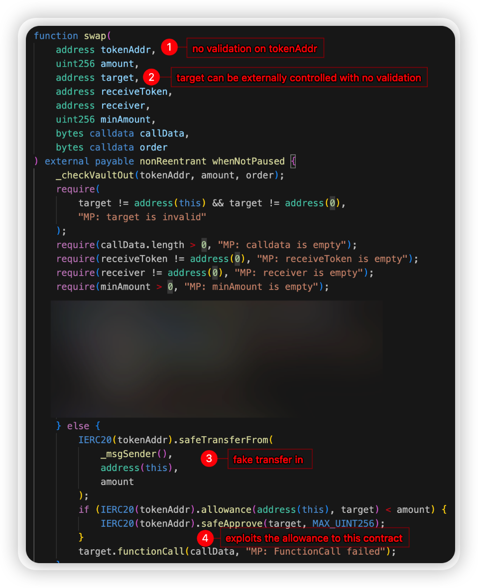
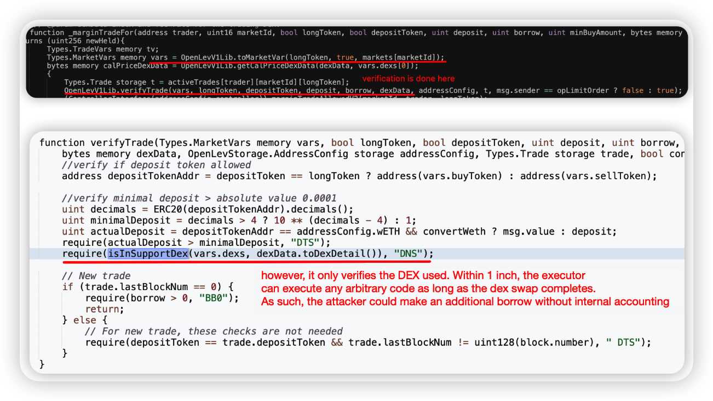
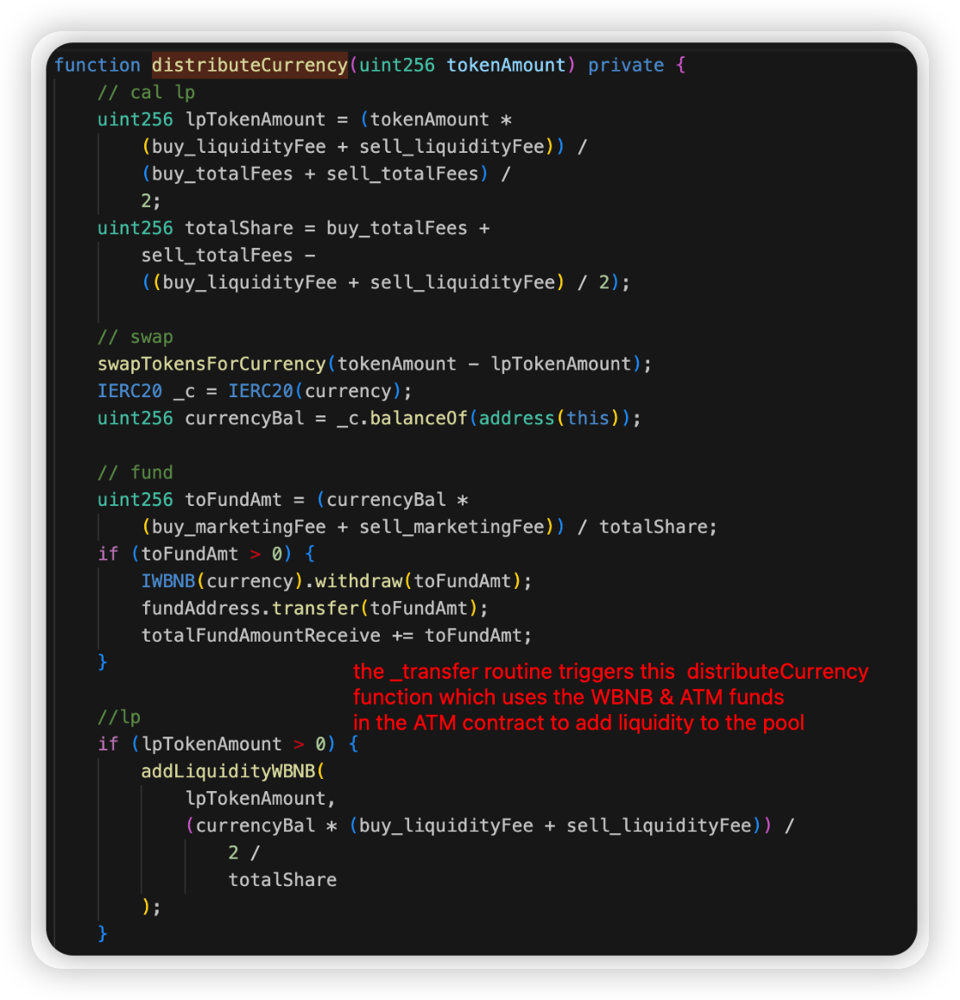

## Introduction

In this monthly series, HashDit is sharing the monthly security incidents in the crypto space and what we can learn from them. For this Apr 2024 edition, the total losses mounted up to $2.7 million, showing a 54% decrease compared to April 2023. 

In this sharing, we focus on the DApps incidents. Below are the top 5 DApps incidents that DApp Developers should pay attention to.

## Top 5 DApps incidents

### XBridge - $1.03m - Wrong Proxy Upgrade

XBridge is a Bridge / Cross-Chain protocol that allows users to bridge funds from one chain to another. In this attack, a vulnerable logic contract was introduced in a proxy contract upgrade, allowing the attacker to drain 466,490,205 STC tokens, 511,424,527 SRLTY tokens and 11,165,018 Mazi tokens, amounting to ~$1.03m. Interestingly, the attacker did not liquidate all tokens, and only swapped ~$192k to BNB and deposited it into Tornado Cash, leaving some tokens in his wallet.

**Root cause**: The listToken function in the target contract does not verify msg.sender and _tokenOwner. Essentially, as long as _baseToken==_correspondingToken, the attacker can set the key variable _tokenOwner to msg.sender which is himself, and subsequently call withdrawTokens to extract the baseToken funds directly.

The upgrade introduced a wrong mapping _tokenOwner instead of using TokenOwner (which was correctly set up in the old logic contract), anyone can thus assume _tokenOwner and withdraw tokens.

**Onchain information**:

[Bug introduced in Upgrade tx](https://bscscan.com/tx/0x26b1c65526a0d932c1e5589e1ec31341cf918e77247ef49d3036810c0cbb09ad)

[Hack tx](https://bscscan.com/tx/0xcf8aa3b9dfcf9250a5da5e9571f98374f1d649024a81b8d5f7da2f7d92f313f9)

 

Code snippet:

### FinanceChainge - $710k - Lack of Validation

FinanceChainge is a DeFi protocol, which is known as a liquid cross-chain aggregator. In this attack, the hackers exploited the swap function with a malicious payload. The hack amount is ~ $710k. Interestingly, the sole victim is 0x8a4aa176007196d48d39c89402d3753c39ae64c1, which is linked to the project team and hence likely funds belonging to the project.

**Root cause**: The swap() function had a bug which allowed hackers to exploit users’ allowance given to this victim contract.

**Onchain information**:

[Hack tx 1](https://bscscan.com/tx/0xd348b5fc00b26fc1457b70d02f9cb5e5a66a564cc4eba2136a473866a47dac08)

[Hack tx 2](https://bscscan.com/tx/0x051276afa96f2a2bd2ac224339793d82f6076f76ffa8d1b9e6febd49a4ec11b2)

Code snippet:

### OpenLeverage - $226k - Internal accounting

OpenLeverage is a DeFi protocol which operates as a DEX, allowing users to swap tokens. In this rather complicated attack, the attacker was able to compromise the OpenLev contract on BSC. The exploit consisted of a sequence of arbitrary external calls, taking advantage of inconsistency in the accounting for borrowers.

**Root cause**: The attack occurred due to a discrepancy in the accounting process, which comprised two separate transactions. 

Firstly, the attacker set up a "margin position" in the OpenLevV1 contract using the marginTrade function. This function call permitted an additional position creation with minimal collateral through an untrusted external call to the OpBorrowing contract. This position was ultimately liquidated. 

However, both OpenLevV1 and OpBorrowing contracts use the LToken contract for their transactions. Consequently, the debt of the margin position was unintentionally cleared in the liquidation process. 

In the second transaction, the attacker exploited this situation. They used the payoffTrade function, bypassing the health check, and drained all the collateral from the margin positions.

**Onchain information**:

[Hack tx 1](https://bscscan.com/tx/0xf08b6d36dc6f650c030344b6307ae94528f77a01db11d1284ed966e7e44337d3)

[Hack tx 2](https://bscscan.com/tx/0x0434bf08a63d70b84fad033d38d8b645498016b3931af4d13f6c11e86848876b )

Code snippet:

### NGFS - $190k - Lack of Validation

NGFS is a DeFi token on BSC. In this attack, the attacker was able to manipulate his own token balance due to a lack of validation for a privileged function. As such, he could simply increase his balance and dump the tokens on the open market.

**Root cause**: The function delegateCallReserves() can be called only once, and is supposed to be set up during the initialization phase, however it was left untouched. As such, anyone could assume _uniswapV2Proxy position and then call the setProxySync() method to set an arbitrary _uniswapV2Library. Lastly, within the reserveMultiSync() function, the attacker could set a large balance for himself since he has _uniswapV2Library privilege.

**Onchain information**:

[Hack tx](https://bscscan.com/tx/0x8ff764dde572928c353716358e271638fa05af54be69f043df72ad9ad054de25)

Code snippet:

### ATM - $180k - Price Manipulation

ATM is a DeFi token on BSC. In this attack, the attacker was able to make use of the funds in the ATM contract to add liquidity to the pool. At the same time, he could invoke the skim function to drain excess funds from the pair.

**Root cause**: The _transfer routine can be exploited by directly transferring funds to the pair contract. This triggers the distributeCurrency function, adding liquidity from the perspective of the ATM contract. The attacker could then profit by simply calling skim on the pair.

**Onchain information**:

[Hack tx 1](https://bscscan.com/tx/0x458ea2d7e6c5953b0d927aabc1c6a144df276d6ffa55b236087763396ee57067)

[Hack tx 2](https://bscscan.com/tx/0xee10553c26742bec9a4761fd717642d19012bab1704cbced048425070ee21a8a )

Code snippet:

## Key lessons for developers

1. Input validation is a crucial process - it's essential to verify all potential user inputs, especially when these inputs affect changes to the state of the system. This holds particularly true in the below scenarios:

    * **Calldata Parameters:** Given that attackers have the ability to craft any data, extra validation steps must be in place for calldata parameters.

    * **User Approvals:** During the process where the protocol contract manages users' approvals, meticulous input checks are paramount to prevent potential malicious activities.

2. To guard against price manipulation, it's essential to ensure that updated prices cannot be influenced to reflect unexpected values. Oracles, both on-chain and off-chain types, can be employed by developers. Here's how:

    * **Set Boundaries:** Implementing limits can block prices from being abruptly manipulated to an impossible value, regardless of the oracle type in use.

    * **Fallback Oracle:** Integrate a secondary oracle as a fallback measure. This ensures that if the initial oracle fails, there is a backup in place to verify the consistency of prices. By doing so, it ensures continuous, reliable price feeds, and safeguards against single point of failure.

3. Upgrading proxy code should be taken very seriously and should require several checks such as:

    * **Thorough Testing**: Conduct rigorous testing before deploying any updates to ensure that the changes will not disrupt existing functionalities or introduce new vulnerabilities.

    * **Code Audits**: Always get your code audited by a third party. It's crucial to have another set of eyes inspect your code, as they may spot issues that you've overlooked.

    * **Pause Functionality**: Make sure that your contract has a 'pause' functionality. In case something goes wrong, this function allows halting the operations until the issue is fixed.

4. Addressing internal accounting errors and effectively handling external arbitrary calls are critical for crypto developers, especially for lending projects which involve complex financial transactions. Here are some recommendations:

    * **Sequencing Transactions**: Consider sequencing transactions appropriately. Generally, it's safer to make state changes before conducting external calls.

    * **External Calls**: Be extremely careful while interacting with third-party contracts. They should be treated as potentially malicious. Avoid state changes after making a call to an external contract.

    * **Precise Accounting**: Keep accurate and precise accounting to make sure all balances tally at the end of each operation. This is primarily to ensure that no tokens are lost or mistakenly created during transactions.

    * **Debt and Collateral Management**: Carefully track and manage computational handling of debt and collateral. Errors in management or calculation can lead to vulnerabilities such as unforeseen liquidations or insolvency.

    * **Limit Permissions**: Limit the permissions of the contract that makes external calls to only what's necessary to reduce your contract's attack surface.

Feel free to contact us at support@hashdit.io for any support needed! Stay safe!

