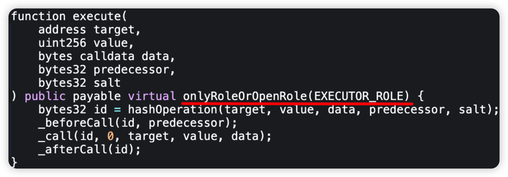
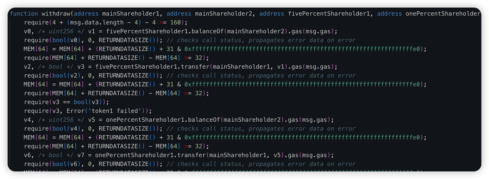
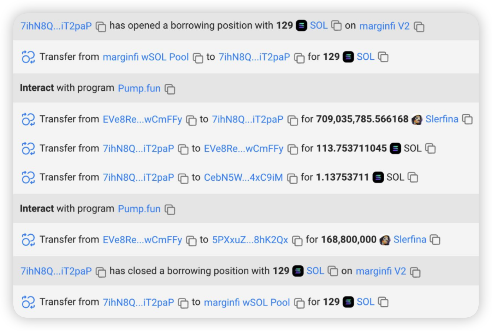

## Introduction

In this monthly series, HashDit is sharing the monthly security incidents in the crypto space and what we can learn from them. For this May 2024 edition, the total losses mounted up to $92.3 million, showing a 16% increase compared to May 2023. 

In this sharing, we focus on the DApps incidents. Below are the top 5 DApps incidents that DApp Developers should pay attention to.

## Top 5 DApps incidents

### GoGalaGames - $21.7m - Private Key Compromise

GoGalaGames is a GameFi protocol that allows players to earn cryptocurrencies and non-fungible tokens (NFTs) through gameplay. In this incident, its minting role’s private key was compromised, leading to a mint of 5,000,000,001 GALA tokens, an estimated loss of ~$222m on ETH. Interestingly, only a portion of GALA tokens were swapped for ETH, amounting to an estimate of 5913 ETH or $22m USD.

Thankfully, funds have since been returned and sent to an address termed as Gala Fund Recovery. Also, the excess GALA tokens have been burned. 

**Root cause**: The hacker was able to compromise the private key of the original Minter account. It is unclear if it was an internal or external attack.

**Onchain information**:

[Mint tx](https://etherscan.io/tx/0xa6d90abe17d17743a9cecab84bcefb0fd0bbfa0c61bba60fd2f680b0a2f077fe)

Code snippet:

### SonneFinance - $20m - Empty Market Attack

Sonne Finance is a decentralized lending protocol for individuals, institutions and protocols to access financial services. It is a permissionless, open source and Optimistic protocol serving users on Optimism. Users can deposit their assets, use them as collateral and borrow against them. In this attack, the hacker made use of a mislapse in the protocol’s market configuration to execute an empty market attack.

**Root cause**: Sonne was aware of the empty market bug, and planned to:
 - timelock add a market
 - user add funds
 - timelock open up the market for use.

It would work, as long as the order was followed. However, they scheduled the supportMarket operation independently, instead of using scheduleBatch. Additionally, they opened the EXECUTOR_ROLE to everyone. This essentially allowed anyone to execute the operations in any order.

The exploited solVELO market was deployed 4 days ago without any liquidity, and added to the Unitroller 2 days later after timelock. As such, this empty market was abused with direct donation to borrow funds from other markets with liquidity.  

**Onchain information**:

[Hack tx 1](https://optimistic.etherscan.io/tx/0xb43748ed668c1e44cf0a3e829ca0fe24eceaee7d33d06072bb11ca99afa7f448)

[Hack tx 2](https://optimistic.etherscan.io/tx/0x9312ae377d7ebdf3c7c3a86f80514878deb5df51aad38b6191d55db53e42b7f0)

Code snippet:

### ALEXLabBTC - $4.3m - Private Key Compromise

On May 15, 2024, ALEXLabBTC, a DeFi project, had an unverified contract compromised, after a malicious upgrade. The potential loss was ~$12m, however the attacker was thankfully inexperienced. The attacker was successfully able to transfer around 13.8 million STX (~$2 million) on the Stack BTC layer-2 chain. 

However, on BSC where the potential damage was $4.3m, a white hat was able to secure funds, and eventually returned all 100% to the project team. On ETH, the exploiter tried to steal assets notionally worth around $5 million, but failed to do so. ALEX Lab later announced they were able to recover or secure around $4.5 million of those assets (through CEX).

**Root cause**: Using compromised private keys obtained via a phishing attack. The exploiter was able to upgrade the code to a malicious logic contract and drain some assets from the ALEX protocol.

**Onchain information**:

[Hack tx](https://bscscan.com/tx/0x47e123af93add709bc2516f6a5db057dfbb1d66a75b693cd7980cd3eb28c7357)

[Malicious upgrade tx](https://www.bscscan.com/tx/0x55bb186c80834ffe00ac673b02fb1e70ac4fad56d4407afcf8bf4f1d716f579e)

Code snippet:

### Pump.fun - $1.9m - Insider Attack

Pump.fun is a Solana Based Memecoin Launchpad that allows users to deploy their own Solana tokens. The incident involved a former employee gaining pump.fun's admin privileges, resulting in the misappropriation of approximately 12,300 SOL, valued around $1.9 million at the time.

**Root cause**: A former employee, illegitimately taken access of the withdraw authority using their privileged position at the company, used flash loans on a Solana lending protocol.

The loans were used to borrow SOL to buy out as many memecoins until they hit 100% on their bonding curves, which allowed the exploiter to gain liquidity to repay the flash loans. This affected roughly $1.9 million out of a total of $45 million in liquidity within the bonding curve contracts during a specific timeframe.

**Onchain information**:

[Hack tx](https://solscan.io/tx/4i1BarkRVtU1RU7eaaTBKrbeDPPVD2D2LcyGFWu1tqCJUsGfkQc61YfsCWz1mQdhknjvP862EoGhs8dgpCVShoED)

Code snippet:

### NORMIE - $800k - Price Manipulation

On the 26th of May, 2024, the Base network suffered a damaging exploit targeted at the memecoin, NORMIE. Due to a vulnerability in the smart contract, there was an unfortunate loss of approximately 224.98 ETH.

**Root cause**: The fundamental catalyst for the exploit was a flaw in the smart contract logic. This flaw granted the attacker the capability to trick the contract into acknowledging their address as a privileged one. This deceptive maneuver allowed them to mint tokens without authorization, circumventing crucial security measures, and consequently leading to a significant financial loss.

**Onchain information**:

[Hack tx](https://basescan.org/tx/0xa618933a0e0ffd0b9f4f0835cc94e523d0941032821692c01aa96cd6f80fc3fd)

Code snippet:

## Key lessons for developers

1. In light of potential insider compromises, it's crucial to apply thorough background checks for new employees. Specifically, keep an eye out for potential red flags including:

    * **Preference for certain platforms:** Malicious developers seem to favor using Github, often impersonating user profiles such as SuperTalentedDev726 or CryptoKnight415.

    * **Use of numbers:** Both email addresses and Github usernames often contain numerical sequences. It's suspected they use this as a method for tracking the identities they impersonate.

    * **Asian identities:** There's a tendency toward choosing Japanese (and possibly Korean) identities, often claiming prior education in Japan.

    * **Prominent educational background:** The falsified credentials often include elite universities in Japan, Hong Kong, and Singapore. Such institutions may include Singapore State University, Nanyang Technological University, University of Hong Kong or Hong Kong University of Science and Technology.

    * **Codebase theft:** While not always the case, these imposters often steal existing projects from GitHub and recondition the commit messages to reflect their assumed usernames.

    * **Multiple applications:** They tend to apply repeatedly for the same job, resorting to multiple email addresses for their submissions.

    * **Premature expertise:** They often claim experience in Solidity/EVM too early (such as in 2015), which is an unlikely scenario giving the nascent state of blockchain technology at the time.

2. To guard against price manipulation, it's essential to ensure that updated prices cannot be influenced to reflect unexpected values. Oracles, both on-chain and off-chain types, can be employed by developers. Here's how:

    * **Set Boundaries:** Implementing limits can block prices from being abruptly manipulated to an impossible value, regardless of the oracle type in use.

    * **Fallback Oracle:** Integrate a secondary oracle as a fallback measure. This ensures that if the initial oracle fails, there is a backup in place to verify the consistency of prices. By doing so, it ensures continuous, reliable price feeds, and safeguards against single point of failure.

3. Keys should be properly secured, are rotated regularly and have some level of decentralization. Adopt a **zero-trust** model. 

4. For projects utilizing lending protocols:
    * When deploying a new market (especially for Compound / Aave v2 forks), ensure that it is first **initialized with 0 Collateral Factor** and **deploy with small deposit to lock dead shares**.
    * Disallow deposits when the pool price is out of the base range of liquidity.
    * Increase precision on price change thresholds and deposit ratios.
    * For those allowing single-sided pool deposits, add a conditional statement to **prevent deposits of any ratio of assets** so long as vault is single-sided.

Feel free to contact us at support@hashdit.io for any support needed! Stay safe!

