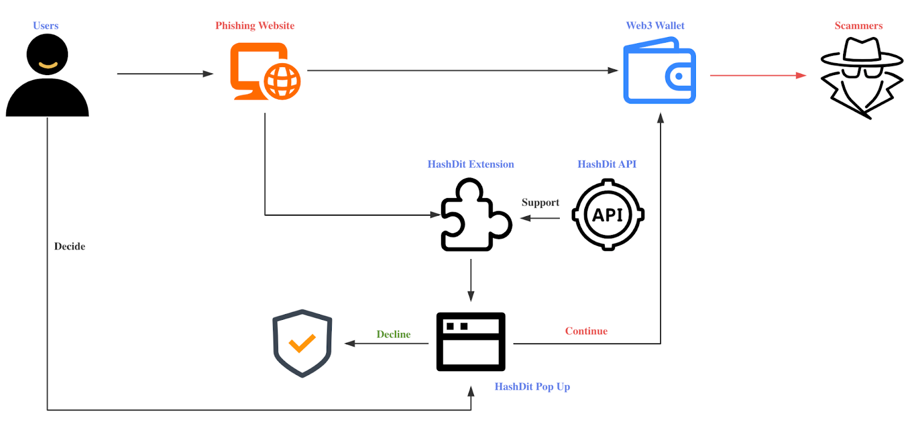
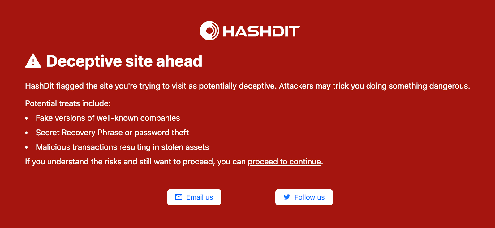

# HashDit Extension

HashDit Extension is a complimentary, open-source web3 security tool designed to shield you from a variety of cyber threats and phishing scams, it is available in the Chrome web store now: [https://tinyurl.com/mnsv3f7y](https://tinyurl.com/mnsv3f7y).

HashDit Extension is designed to serve as an extra layer of protection when interacting with websites that involve digital assets. It works by sitting in between websites and extension-based wallets like TrustWallet and MetaMask, analyzing transactions, identifying risk factors, and alerting you to potential threats. 

HashDit Extension applies multi-layered defense mechanisms to safeguard your online interaction.

## Layer1: Realtime Phishing Scanning Before Connecting Website

HashDit extension proactively identifies new risky websites and alerts you of any phishing or scam websites before interacting, preventing any accidental divulgence of your sensitive information or funds.
Potential wallet drainers can connect and clean out your wallet before you realize it. HashDit Extension patrols your wallet perpetually, identifying potential threats before they could connect to your wallet.

<i> Phishing Website Warning of HashDit Extension </i> 

## Layer2:  Well-Rounded Detection Before Proceeding Transaction & Signature

The HashDit Extension combines the website, transaction, contract and receipt address information to deliver well-rounded detection and analysis.  
By generating warnings about risky transactions or suspicious signatures, the HashDit Extension ensures that you are aware of potential harm before proceeding with any transaction.

<i> Transaction Analysis Pop Up of HashDit Extension </i> 

HashDit Extension goes beyond just warnings. It provides easy-to-understand insights into transactions and signatures, increasing users’ knowledge and awareness,  which is especially helpful for newcomers in the crypto world.
 

<i> Signature Insight of HashDit Extension Pop Up </i> 

Most importantly, your data privacy is our prime concern. HashDit Extension has been engineered to never access your seed phrase or private key. We cannot, and will not, access your wallet directly, giving you peace of mind and secure browsing.  

Currently, HashDit Extension supports Ethereum, BNB Chain, and plans to include more chains like Polygon and opBNB in the future.

## Type of Risks Detected by HashDit Extension
| Scam Type      | 	Example |	Coverage |
| ----------- | 	----------- |	----------- |
|Wallet Drainers|	Sophisticated scam groups which use different measures such as tricking users to ‘approve’ their funds to the scammers, resulting in their NFTs, tokens, or other assets being stolen.|	Y|
|Malicious signatures|	Misleading functions with ill-intent, such as 'Set Approval For All', 'eth_sign', etc which can lead to users losing their assets.|	Y|
|Low trust domains|	Websites with very low reputation, often linked to spam, malware, social engineering phishing, and scams. They usually impersonate notable online platforms.|	Y|
|High risk contract method calls|	Risky method calls such as 'SecurityUpdate()', which are designed to deceive users into sending ETH to the scam contract.|	Y|
|Honeypot detection & other smart contract risks|	Honeypot token is one example which only allows users to trade into an asset without being able to sell it afterwards. Other risks include but are not limited to: backdoor, scam tokens and centralization risks.|	Y|
|Rug pulls|	Sudden abandonment of a project by the scam creator(s), after the team initially promises to work and develop on the project. This usually occurs once the investment amount by the victims is deemed enough by the scam creators.|	Y|
|Address poisoning|	The attacker creates a vanity address that is very similar to the victim's address. They then send very small amounts of cryptocurrency to the victim's address, hoping when victims see a transaction for a token they typically interact with in their transaction history, victims might copy the recipient address (thinking it is their own) and then send funds to that address.|	Y|
|Seed phrase compromise|	Scams to steal the users’ seed phrases/private keys, thereby being able to control their crypto assets.|	Coming soon|
|Malware|	Malicious software disguised as attractive downloads and campaigns.|	Contact us|
|Malicious extension|	Posing as utility software while engaging in harmful activities.|	Contact us|