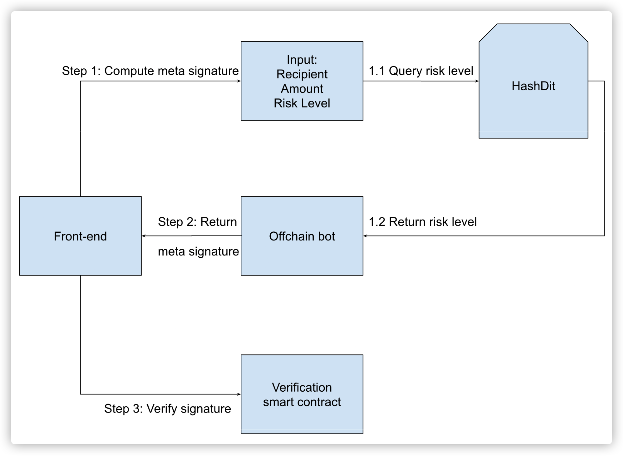

# Meta-Signature Strategy

## Introduction

The main idea of the Meta-Signature Verification strategy is to ensure the authenticity and integrity of transaction risk data computed off-chain by verifying it on-chain. The project's front-end program obtains risk data by querying HashDit, then calculates the signature and packs the signature data into the transaction for transmission. By verifying the meta-signature data, which includes the transaction risk level, on the chain, the reliability of the data can be validated. The transaction will then proceed to different disposal processes based on the acquired transaction risk level. 

The Meta-Signature strategy incorporates the concept of zero-knowledge proof, ensuring complete computational integrity while preventing the leakage of private information. This strategy introduces a low-cost advanced security measure, offering a powerful safety layer that ensures the integrity of computations and the protection of sensitive data within decentralized applications.

## Integration

The front-end of the project needs to integrate our SDK. During transaction call from the front-end, transactional data would incorporate off-chain signed risk data, which is procured from HashDit. Subsequently, the project's smart contracts also need to integrate our SDK, which includes a call to the on-chain verification contract to validate the effectiveness of the risk data.
 
## Advantages & Limitations

### Advantages

By applying the concept of zero-knowledge proof, this strategy overcomes the limitation of not being able to access off-chain from on-chain, ensuring the security of transactions from a completely new dimension with low cost.

### Limitations

Integration is more complicated. It necessitates not only modifications to the project's smart contracts, but also, in particular, customized alterations to the project's front end to incorporate query and signature logic for risk data.

## Real-world Use Case Example

Consider an instance of a real-world private key leak incident at PancakeSwap. Since April 12, 2021, someone authorized to access the Binance Smart Chain account 0x35f16a46d3cf19010d28578a8b02dfa3cb4095a1 (PancakeSwap admin account) has, over multiple operations, stolen 59,765 Cakes (approximately 1,800,000 US dollars) from the PancakeSwap lottery pool.

This hacking incident could have been deterred by our Meta signature strategy. During the execution of the attack transaction, the transaction dispatched by the frontend would include off-chain signed risk level data. As the risk level for this sender's address is high in HashDit, the attack transaction would consequently be rolled back, preventing the hacker from successfully carrying out the attack.

The Meta signature strategy can effectively block such cases involving complex logic of transfer functions at relatively low costs, with all operations still taking place within a single transaction.