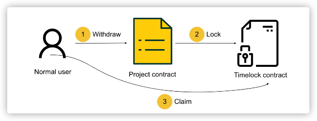
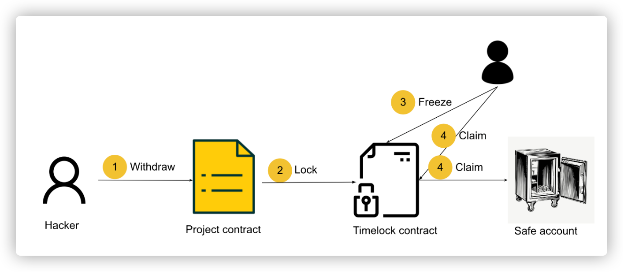

# Timelock Strategy

## Introduction

The Timelock strategy is suitable for some basic transfer scenarios. For example, the withdrawal of the staking contract, the transfer of the token contract, the deposit of the farm contract, etc. However, it cannot be applied to more complex scenarios such as token swaps.
The basic assumption of the Timelock strategy is that when the user calls the project contract to transfer the money, if the involved fund size triggers the threshold preset by the project party, the funds will be automatically transferred to the Timelock contract. Before the end of the lock time set by the project team, the project team has the right to manage the funds, including freeze/withdraw/unfreeze. HashDit displays the risk level of the transaction through the supporting front-end webpage, which is derived from the risk database accumulated by HashDit. The project team can refer to the transaction risk rating of HashDit to make corresponding disposals. If no action is taken on their end during the locked period,, the funds will be automatically unlocked as soon as the lock time expires, and users can claim their own funds.

The Timelock strategy is of great significance for protecting some hackers' transfer operations.
The following two diagrams illustrate the different execution processes between normal transactions and malicious transactions.

For Normal Transaction:

* Step 1: The user initiates a fund withdrawal by submitting a transaction to the project smart contract.
* Step 2: When the transaction amount triggers the threshold preset by the project team, the funds are transferred to the Timelock contract.
* Step 3: The project team did not make any disposal of the transaction funds, because the HashDit frontend page shows that the transaction has a low risk rating. When the lock time is up, the funds are automatically unlocked, and the user claims the funds to the Timelock contract, and the withdrawal is completed.

For Malicious Transaction:

* Step 1: The user initiates a fund withdrawal by submitting a transaction to the project smart contract.
* Step 2: When the transaction amount triggers the threshold preset by the project team, the funds are transferred to the Timelock contract.
* Step 3: Because the HashDit frontend indicated that the recipient's address in this transaction was on the blacklist and tagged as 'hacker', the project team identified this as a hacking transaction. Consequently, they executed the freeze method in the Timelock contract to freeze the funds.
* Step 4: The project team calls another privileged function in Timelock, claim, to withdraw the funds to a secure account. This money hackers will not be able to get.

## Integration

The integration process is not complex; all it requires is using our SDK to incorporate the invocation logic from the lock functions in the Timelock smart contract into the project's smart contract.

## Advantages & Limitations

### Advantages

1.	Deployment is simple and straightforward. As long as the customer integrates and utilizes our SDK in the project, the financial guarantee can be realized.

### Limitations

1.	This strategy is only suitable for simple and direct transfer logic, and is not suitable for more complex fund transfer scenarios such as swap tokens. 
2.	It is not possible to perform all operations in a single transaction; It requires at least two separate transactions.

## Real-world Use Case Example

Take the real-world case of the UvToken being compromised, for example. The UvTokenWallet Eco Staking pool contract was hacked; the key reason for the vulnerability is that the withdrawal function in pool contract did not strictly judge user input, leading to an attacker directly passing in a malicious contract address and using it to drain the relevant funds. Subsequently, the hacker transferred a total of 5,011 BNB to Tornado Cash. Moreover, the transaction fees for the attack also came from Tornado Cash.
This hacking event could have been intercepted by our Timelock strategy. When the hacker attempted to drain the staking contract and the transfer amount exceeded the threshold, the hacked funds would have been transferred into the Timelock contract. Control over these funds would then revert to the project party.
The Timelock strategy can effectively intercept such simple transfer scenarios of being hacked, regardless of how complex the vulnerabilities utilized by the attacking method are.