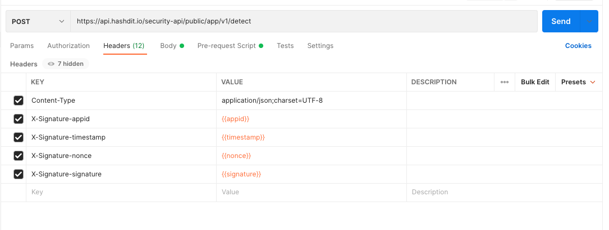
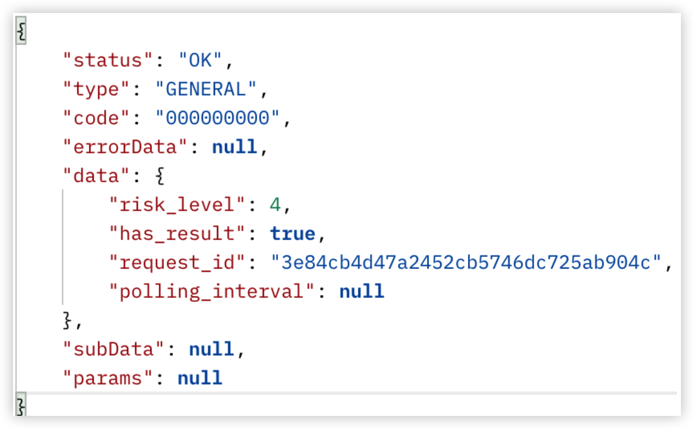

# How to use the HashDit API

## Tutorial
In this tutorial, we will provide a step-by-step guide on how to use the HashDit API using Postman. 
 
1. **Prerequisite:** The service scope of this API is currently limited to users who have applied for access by sending a request to support@hashdit.com. The received appid and appsecret are essential to accessing the API.


2. **API Endpoint**: https://api.hashdit.io/security-api/public/app/v1/detect  


3. After you have received appid and appsecret, you will navigate to Postman and generate a request using a Pre-request Script, as shown in the figure below. Make sure that you have specified the following parameters correctly.
    - Method type should be selected as POST, as shown in step1 in the figure below.
    - Specify the correct request URL, as shown in step2 in the below figure.
    - Provide a pre-request script.
    - Set the required header(s).


4. **Pre-Request Script**: In this script, you will specify the appid, appsecret, uuid, set the body of the request, set the signature, set the headers, and set the global variables.
   - In lines 1 to 8, we set values for different variables, these will be then used to set the headers of the request as shown below.



   - For server authorization, whenever the client calls the server’s restful interface, it is required on the client side to set the following headers as described in the table below to be able to pass the server authorization. 
   
| Header                | Value                          | Description                                                                                                                                                                                                          |
|-----------------------|--------------------------------|----------------------------------------------------------------------------------------------------------------------------------------------------------------------------------------------------------------------|
| Content-Type          | application/json;charset=UTF-8 |                                                                                                                                                                                                                      |
| X-Signature-appid     | appid                          | unique code received after applying at support@hashdit.com                                                                                                                                                           |
| X-Signature-timestamp | timestamp                      | millisecond                                                                                                                                                                                                          |
| X-Signature-nonce     | nonce                          | Random uuid, replace “-” with “”, 32 byte length                                                                                                                                                                     |
| X-Signature-signature | signature                      | Hash of appsecret, appid, timestamp, nonce, method, uri, query, body. <br />**Note:** Where uri is the path，multiple key-value pair  in query and header should be **sorted** alphabetically by key, comma separated |

5. **Setting Body of the Request:**
   - After specifying the pre-request and headers, set the body of your request. To know about the different input fields, parameters, and output details, you can refer to the official documentation.   
   - In this tutorial, we have used the raw format to set the body of our request, as shown in the figure below. However, it is up to you to choose whatever of the supported types you wish to use. As input parameters for the API, we have passed the address and chain_id key-value pairs.


   - In the body of the message, if you are wanting to scan a smart contract for a dapp for risk analysis, the passed parameters are as described below

| Name     | Required | Description                                                     | Type   | Example                                                                                                                                                                                                                               |
|----------|----------|-----------------------------------------------------------------|--------|---------------------------------------------------------------------------------------------------------------------------------------------------------------------------------------------------------------------------------------|
| chain_id | ✅        | Chain id of the blockchain the contract to check is deployed on | string | 56 (BSC Mainnet)                                                                                                                                                                                                                      |
| address  | ✅        | Contract address that needs to be scanned for risk factor       | string | 0x312bc7eaaf93f1c60dc5afc115fccde161055fb0(No Risk)<br />0x1ffaa3176d63a4889391f628e6f3c934cf00c9ba(Low Risk)<br />0x57eba2d1adf4102051ac8094aec65d48d6c3bfae(Medium Risk)<br />0x4debab03731a326c04f69621c3de3e1bc0b34ff8(High Risk) |

6. **Send Request:** click on the Send button to send your request.
7. **Response:**
   - If everything goes well, the response received for the contract address (0x312bc7eaaf93f1c60dc5afc115fccde161055fb0), the response will be as shown in the figure below.


   - The different parameters in the response are as explained in the table below

| Name             | Nullable | Description                                                                                                 | Type   | Example                                                                                                                                                                                                                                                                                                                                                                                                                                               |
|------------------|----------|-------------------------------------------------------------------------------------------------------------|--------|-------------------------------------------------------------------------------------------------------------------------------------------------------------------------------------------------------------------------------------------------------------------------------------------------------------------------------------------------------------------------------------------------------------------------------------------------------|
| status           | ❌        | Result of operation                                                                                         | String | OK： The scanning process terminated as expected <br />ERROR： Exception thrown or unexpected situation met                                                                                                                                                                                                                                                                                                                                             |
| code             | ❌        | Result code of operation                                                                                    | Integer    | 00001:verify signature error<br /> > appid, timestamp, nonce, signature headers can not be null or empty<br />> nonce is illegal<br />> timestamp has illegal<br />> timestamp is expired<br />> invalid appid<br />> appid has expired<br />> invalid signature<br />> replay request<br />> app is out of count limit<br />00002:unknown server error occurred during verifying signature<br />00003:unknown server error occurred during detection |
| **Data**         | ❌        | **The following parameters are part of data**                                                               |        |                                                                                                                                                                                                                                                                                                                                                                                                                                                       |
| request ID       | No        | Unique request id                                                                                           | String |   96c9d4c578ec466db51ed5290dd84463                                                                                                                                                                                                                                                                                                                                                                                                                                                    |
| risk_level       | No       | 6 levels risk classification                                               | Integer   |                                                                                                                                                                                                                                                                                                                                    |
| risk_level_description | No        | 6 levels risk classification description | String   | risk level shorten version ([link](./risk-level-description/risk-level-description-short.md)) |
| has_result       | No       | Whether there is already a definite result, if False it needs to be requested in [polling_interval] million seconds | Boolean   | True                                                                                                                                                                                                                                                                                                                                                                                                                                                  |
| polling_interval | Yes       | Recommended waiting time(million seconds) to the next repeat request. seconds                                                                   | Long   | 60000                                                                                                                                                                                                                                                                                                                                                                                                                                                    |

## Conclusion

One of the core missions of Hashdit is to provide the everyday DeFi investors with the essential threat intelligence that will empower them in making informed decisions. Investing in DeFi can be both highly profitable as well as filled with pitfalls,since it is difficult for both entrant and experienced investors to successfully navigate through this massive landscape. To bridge this gap, HashDit aims to provide timely and comprehensive threat intelligence on DeFi projects, the HashDit Address Query Public API is one such attempt. It can be used to query the risk that may be associated with a token or a smart contract due to several different vulnerabilities. In this tutorial, we have provided a step-by-step guide on how to use the API with Postman to check a smart contract's risk factor(s).
 
**Pre-request Script used in this tutorial**
```javascript
var appid = "add your appid";
var appSecret = "add your appSecret";
var uuid=require('uuid');
var timestamp = new Date().getTime();
var nonce = uuid().replace(/-/g, '');
const body=pm.request.body.raw
var hash = CryptoJS.HmacSHA256(appid+";"+timestamp+";"+nonce+";"+"POST;/security-api/public/app/v1/detect;"+ body, appSecret)
var signature = CryptoJS.enc.Hex.stringify(hash)
 
console.log("signature:" + signature)
pm.globals.set('appid', appid);
pm.globals.set("timestamp", timestamp);
pm.globals.set("signature", signature);
pm.globals.set("nonce", nonce);
```
